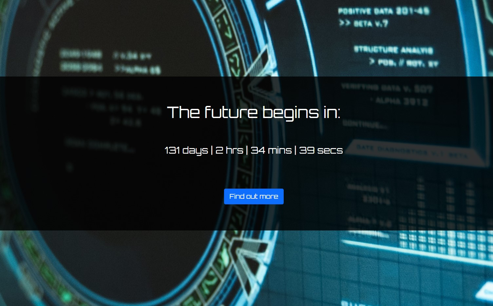
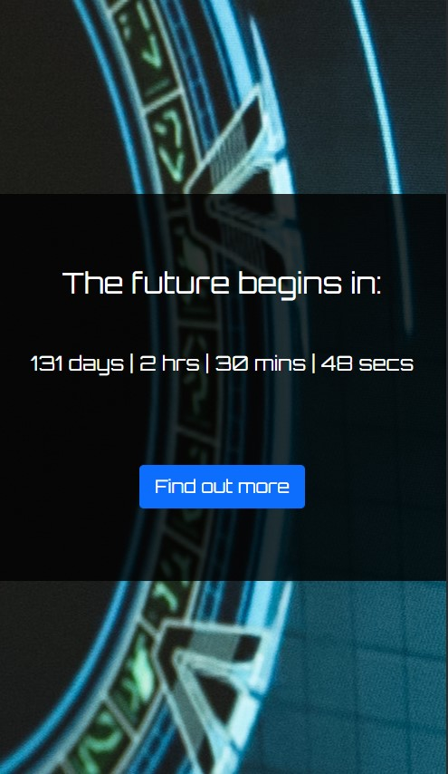

# STARTUP LANDING PAGE WITH TIMER<!-- omit in toc -->

 

## Version 1.0<!-- omit in toc -->

- **Project Start:** February 16, 2022
- **Project End:** February 19, 2022

 

# CONTENTS
- [CONTENTS](#contents)
  - [Introduction](#introduction)
  - [Screnshots](#screnshots)
    - [DESKTOP](#desktop)
    - [MOBILE](#mobile)
  - [Methodology](#methodology)
  - [Tools I Used](#tools-i-used)
  - [What I learned](#what-i-learned)
  - [Items for further study](#items-for-further-study)
  - [Helpful sites](#helpful-sites)
  - [About me](#about-me)

Introduction
---
This is a fully responsive Startup Landing page where people can sign up to receive update emails about an soon-to-be-launched Startup company. The Landing Page has a timer counting down to the launch of the mysterious company in question (the date it's counting down to, July 1st, is my personal deadline for completing the "Become a Front Developer" Career Path on the Zero-to-Mastery website).

This project is from the "Complete Web Developer in 2022: Zero to Mastery" course on the [Zero-to-Mastery website](https://zerotomastery.io/).

 

Screnshots
---
 

### DESKTOP

 

 

### MOBILE

 

 

Methodology
---

This largely remained unchanged [from its predecessor](https://github.com/Infinity-Mineeva/Startup-Landing-Page) in terms of how the page works. The only addition I made was a timer counting down to a specific date. I remembered doing an exercise on w3schools for how to create a simple countdown timer. I dug up my old notes and incorporated the code into this, tweaking as needed. 

 

Tools I Used
---
* HTML5
* CSS3
* Javascript
* Bootstrap
* Mailchimp

 

What I learned
---
It was certainly a refresher, particularly with the `setInterval()` method and calculating times. Also, trying to remember the `position` property, its values, and which one I needed to use in my css.

 

Items for further study
---
I'm still interested in learning more about Bootstrap to satisfy my own curiousity if nothing else. It's been awhile since I've visited w3schools, and I've noticed that they have a Bootstrap Tutorial Section. I'm considering going through that when I have some spare time.

 

Helpful sites
---
- **How TO - JavaScript Countdown Timer (w3Schools)**: [https://www.w3schools.com/howto/howto_js_countdown.asp](https://www.w3schools.com/howto/howto_js_countdown.asp) -- The countdown timer tutorial I orginally did was here. Very straightforward, to boot! Check it out!

 

About me
---
Thanks for checking out this project! 😃 You can find my profiles at these sites:
- [Twitter: @IT_Sonji](https://twitter.com/sonji_it)
- [Frontend Mentor - @infinity-Mineeva](https://www.frontendmentor.io/profile/Infinity-Mineeva)